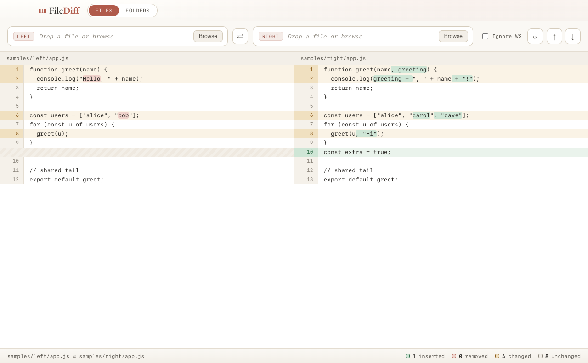

# FileDiff

A spartan‑yet‑elegant, local **side‑by‑side file & folder diff** desktop app, built with
Electron and vanilla JS (no bundler, no build step).



## Features

- **Side‑by‑side file diff** with line‑number gutters and **aligned rows** (filler rows
  keep both sides lined up across insertions/deletions).
- **Color‑coded changes** — inserted (green), removed (red), changed (amber) — kept muted.
- **Word‑level intraline highlights** mark the exact words that changed in a modified line.
- **Synchronized scrolling**, **Next/Prev change** navigation, **Swap sides**, **Reload**,
  and an **Ignore‑whitespace** toggle.
- **Folder compare** mode — recursively walks two directories and shows
  added / removed / modified / identical per file; click a modified file to diff it.
- **Drag‑and‑drop** files or folders onto either slot.
- Safe by design: `contextIsolation` on, `nodeIntegration` off, all filesystem access in
  the main process; an 8 MB size cap and binary sniff guard the reader.

## Run

```bash
npm install
npm start
```

That's all you need — the app opens in its own window.

### Quick tour

1. Click **Browse** on the Left and Right slots (or drag two files in).
2. The diff renders instantly; the footer shows inserted / removed / changed / unchanged.
3. Use **↑ / ↓** (or ⌥↑ / ⌥↓) to jump between changes, **⇄** to swap, **⟳** to reload.
4. Switch to **Folders** in the title bar, pick two directories, then click any
   **modified** file to open its side‑by‑side diff.

A set of sample files lives in `samples/left` and `samples/right` to try it out.

## How it works

| Piece | File | Role |
| --- | --- | --- |
| Main process | `main.js` | Window, native dialogs, file reading, IPC |
| Preload | `preload.js` | Exposes a tiny `window.fileDiff` API over `contextBridge` |
| Folder compare | `lib/folder-compare.js` | Pure‑Node recursive walk + compare (size → SHA‑1) |
| Diff engine | `renderer/diff-view.js` | jsdiff alignment, word marks, sync scroll, nav, stats |
| Folder view | `renderer/folder-view.js` | Tree render + open‑on‑click |
| UI shell | `renderer/index.html` + `styles.css` | Toolbar, panes, stat bar, design tokens |

See **`Project-FileDiff-Plan.html`** (open in a browser) for the full concept &
architecture write‑up.

## Verify (headless)

The renderer can be driven offscreen to produce screenshots without opening a window:

```bash
./node_modules/.bin/electron scripts/screenshot.js          # file diff → samples/diff-screenshot.png
./node_modules/.bin/electron scripts/screenshot-folder.js   # folder view → samples/folder-screenshot.png
```

The folder‑compare logic is plain Node and unit‑checkable directly:

```bash
node -e "require('./lib/folder-compare').compareFolders('samples/left','samples/right').then(r=>console.log(r.counts))"
# → { added: 1, removed: 1, modified: 2, identical: 1 }
```

## Package into a Mac app (.dmg)

```bash
npm run dist
```

This runs `electron-builder` (already in `devDependencies`) and produces a drag-to-install
disk image:

```
dist/FileDiff-1.0.0-arm64.dmg     # open it, drag FileDiff to Applications
dist/mac-arm64/FileDiff.app       # the app bundle itself
```

Open the `.dmg`, drag **FileDiff** into **Applications**, and launch it from Spotlight or
Launchpad like any other Mac app. The app uses the custom icon in `assets/icon.icns`
(generated from `assets/icon.svg`).

> **First launch — "unidentified developer".** The build is unsigned (ad-hoc), so the
> first time you open it macOS will warn. Right-click the app → **Open** → **Open** once,
> and it launches normally from then on. Proper signing/notarization needs a paid Apple
> Developer account and isn't required for personal local use.

### Regenerating the icon

`assets/icon.icns` is built from the 1024px master with macOS's built-in tools:

```bash
# 1. render assets/icon.svg → assets/icon.png (1024px) with Electron:
./node_modules/.bin/electron scripts/render-icon.js
# 2. build the iconset (sips) and compile to .icns:
iconutil -c icns FileDiff.iconset -o assets/icon.icns
```

## Roadmap

- Per‑line syntax highlighting composed under the diff marks
- Inline (unified) diff toggle
- Recent file/folder pairs
- Configurable ignore globs for folder compare

## License

MIT
